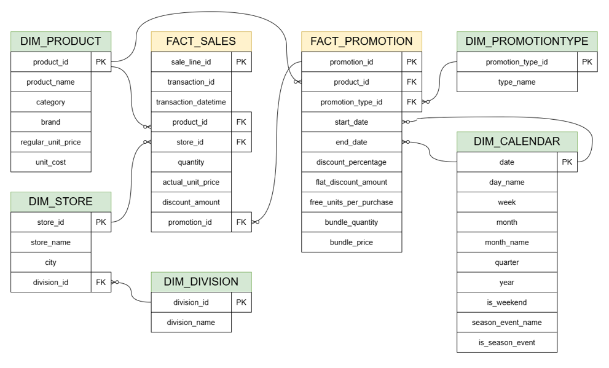

# Trade Promotion Effectiveness (ROI Analysis)

Analyzing 3 years of retail data for **FreshMart BD** (a fictional Bangladeshi retail chain) to determine the **real (net) ROI** of trade promotions — after removing cannibalization and forward-buying effects — in order to optimize next quarter's promotional budget.

## Business Problem

Retailers spend heavily on trade promotions (discounts, BOGO, bundles) but raw sales lift during a promotion is often misleading — some of that "lift" is just customers switching from a competing product in the same category (**cannibalization**) or stocking up early and buying less afterward (**forward-buying**). Without correcting for these, a promotion can look profitable when it's actually a net loss.

## Business Question

> Using 3 years of historical data, which promotion type and which product category/region combination deliver the highest **real (net) ROI** — after removing cannibalization and forward-buying (stockpiling) effects — in order to optimize next quarter's promotional budget?

## Tech Stack

- **SQL (T-SQL, SQL Server / SSMS)** — data preparation, audit, and the Net ROI calculation chain (11 views)
- **Power BI (DAX)** — dashboard and time-intelligence measures
- Synthetic dataset generated in Python, following real-world POS and retail-economics logic (see Data Notes below)

## Data Model

A star schema with 7 tables:

| Table | Type | Description |
|---|---|---|
| `Fact_Sales` | Fact | Transaction/line-item level sales (~800K rows, 3 years) |
| `Fact_Promotion` | Fact | 475 promotion events across 36 products, national-level |
| `Dim_Product` | Dimension | 36 products across 8 categories, 4–5 competing brands each |
| `Dim_Store` | Dimension | 20 stores across 8 Bangladesh divisions |
| `Dim_Division` | Dimension | 8 real Bangladesh divisions |
| `Dim_Calendar` | Dimension | Daily calendar (Oct 2023–Sep 2026) with BD weekend (Fri–Sat) and seasonal event flags (Eid, Puja, Pohela Boishakh, Black Friday, Year-End Sale) |
| `Dim_PromotionType` | Dimension | 4 promotion mechanics: Percentage Discount, Flat Discount, BOGO, Bundle Offer |

**Hierarchy:** `Fact_Sales → Dim_Store → Dim_Division` (city lives on Dim_Store, not Dim_Division — a division has many cities, a store has exactly one)



*Note: `Fact_Sales.transaction_datetime` is not linked to `Dim_Calendar` by a formal foreign key — a date-time value can't directly reference a date-only key. The relationship is enforced through audit checks instead (`CAST(transaction_datetime AS DATE)`), see `DECISION_LOG.md`, Decision 3.3.*

## Data Notes

This project uses a **synthetic dataset**. `Dim_Calendar`, `Fact_Promotion`, and `Fact_Sales` are generated with the Python scripts in [`scripts/`](./scripts) (see below); `Dim_Product`, `Dim_Store`, `Dim_Division`, and `Dim_PromotionType` were curated manually (small, static reference tables). The generation logic follows real-world data logic rather than random values:
- Transaction/line-item grain (not pre-aggregated), matching how real POS systems capture sales
- Category-specific profit margins (thin margins for staples like Rice/Oil, higher for branded Snacks/Beverages)
- Promotion mechanics captured the way they'd actually appear on a receipt (e.g., BOGO as two line items — one paid, one free; Bundle discounts as a separate adjustment, not blended into unit price)
- Category-aware discount depth: thin-margin categories (Rice, Cooking Oil) get shallower discounts (3–7%) than high-margin ones (Snacks, 12–20%), mirroring how real retailers calibrate promotions to what a category's margin can sustain
- Deliberately simulated effects so the analysis has real signal to uncover: promotion-driven sales lift (varies by promotion type), cannibalization of non-promoted same-category brands, and post-promotion forward-buying suppression, layered on top of weekend and seasonal demand patterns

**Scope limitation (intentional):** The product catalog is treated as static across the 3-year window — no new product launches or discontinuations are modeled, since this doesn't affect the core business question.

## Methodology

Net ROI for each of the 475 promotion events is built as a chain of SQL views (`sql/04_roi_views.sql`), each verified before the next one is built:

```
Net ROI = (Incremental Profit − Cannibalization Loss − Forward-Buy Loss − Promotion Cost) / Promotion Cost
```

- **Incremental Profit:** units sold above baseline, valued at the realized margin (average realized price − unit cost)
- **Baseline:** a *matched day-type* average — each promo day is compared only against non-promo days of the same type (normal / weekend-only / season-only / weekend+season), so seasonal and weekend demand isn't mistaken for promotion lift
- **Cannibalization Loss:** shortfall in other same-category products' sales during the promotion, valued at their own margins
- **Forward-Buy Loss:** shortfall in the promoted product's own sales in the 5 days after the promotion ends
- **Promotion Cost:** calculated per mechanic — discount × units for Percentage/Flat, cost price of free units for BOGO, recorded `discount_amount` for Bundle

## Key Findings (Step 4)

**None of the 32 category × promotion-type combinations was profitable** once cannibalization and forward-buying were netted out (475 promotions analyzed).

| | Combination | Avg. Net ROI |
|---|---|---|
| Least damaging | Snacks + Bundle Offer | −0.82 |
| | Dairy + Bundle Offer | −1.00 |
| | Cooking Oil + Bundle Offer | −1.09 |
| Most damaging | Soap & Detergent + Flat Discount | −2.11 |
| | Snacks + Flat Discount | −1.91 |
| | Beverages + Flat Discount | −1.74 |

- **Bundle Offer is consistently the least damaging mechanic** (it takes the top 9 of 32 spots) — its discount is structurally contained, unlike BOGO (~50% effective discount) or deep Flat Discounts.
- **The result is structural, not a data artifact:** promotion cost applies to *every* unit sold at the discount, while profit only comes from the *incremental* units the promotion created. This matches the widely documented pattern in real CPG/retail research that most trade promotions are unprofitable on a raw margin basis.
- **Methodological lesson:** a naive promo-vs-non-promo comparison hid the cannibalization effect (seasonal demand cancelled it out) — controlling for day type is what made it visible. See `DECISION_LOG.md` (Decisions 3.4, 4.1–4.4) for the full reasoning, including the discount-range correction made after the first results came back all-negative.

*Dashboard and final recommendations are coming in Steps 5–6.*

## Project Status

| Step | Status |
|---|---|
| 1. Business Question | ✅ Done |
| 2. Data Design | ✅ Done |
| 3. SQL — Data Prep & Audit | ✅ Done |
| 4. Core Calculations (ROI Logic) | ✅ Done |
| 5. Power BI Dashboard | ⏳ Pending |
| 6. Insight & Documentation | ⏳ Pending |
| 7. Portfolio Publish | ⏳ Pending |

## Decision Log

Every major decision in this project — including alternatives considered and why they weren't chosen — is documented in [`DECISION_LOG.md`](./DECISION_LOG.md).

## Repository Structure

```
├── data/
│   ├── dim_product.csv
│   ├── dim_store.csv
│   ├── dim_division.csv
│   ├── dim_calendar.csv
│   ├── dim_promotiontype.csv
│   ├── fact_promotion.csv
│   └── fact_sales.csv
├── scripts/
│   ├── generate_dim_calendar.py
│   ├── generate_fact_promotion.py
│   └── generate_fact_sales.py
├── sql/
│   ├── 01_schema_constraints.sql
│   ├── 02_audit_queries.sql
│   ├── 03_business_logic_verification.sql
│   └── 04_roi_views.sql
├── powerbi/           (coming in Step 5)
├── DECISION_LOG.md
└── README.md
```

## Author

Suborno — Data Analyst / BI Analyst (entry-level), Dhaka, Bangladesh
